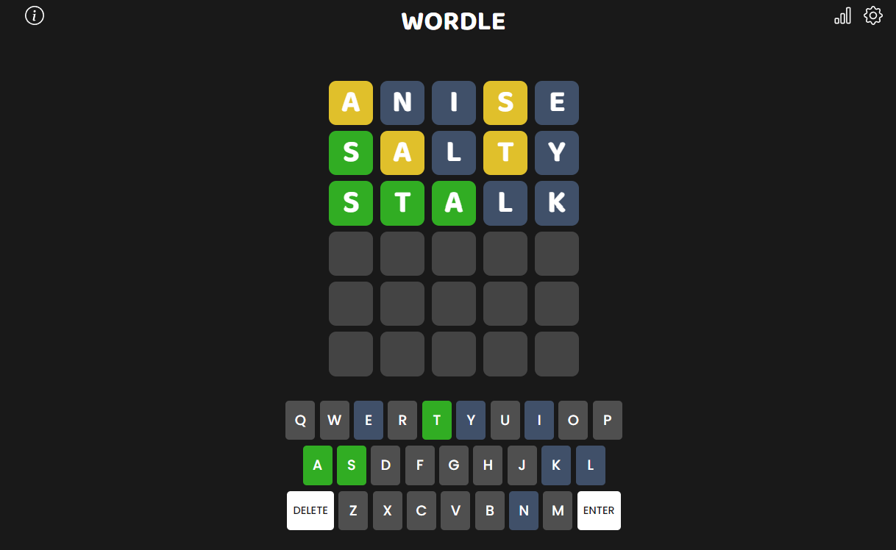

# React Wordle

Wordle game clone created using React, SASS



### To Run Locally:

In the project directory, you can run:

```bash
npm install
npm run start
```

Runs the app in the development mode.\
Open [http://localhost:3000](http://localhost:3000) to view it in your browser.

### To Build For Production:

```bash
npm run build
```

Builds the app for production to the `build` folder.\
It correctly bundles React in production mode and optimizes the build for the best performance.

The build is minified and the filenames include the hashes.\
Your app is ready to be deployed!
